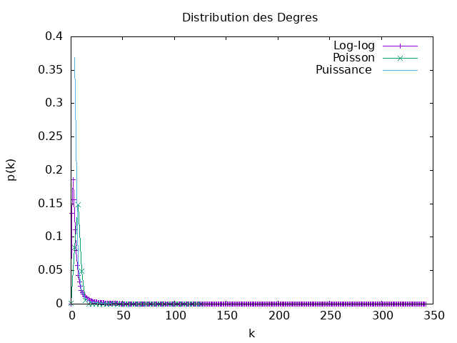
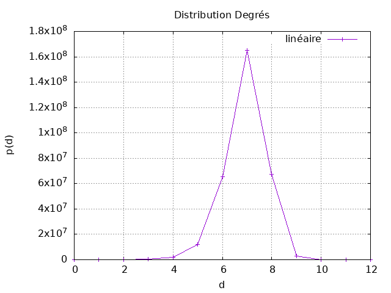
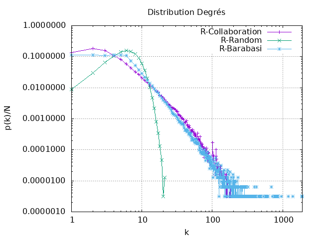
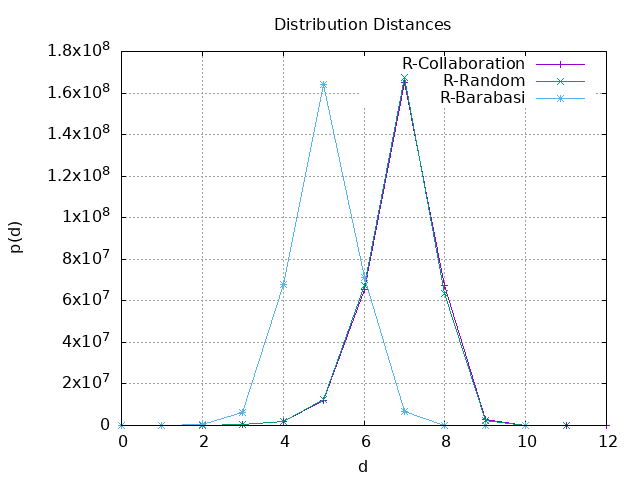

## Mesures de réseaux d'intéraction (réseau de collaboration scientifique en informatique)


## Question 2

Quelues Mesures de base :
```
|N| = 317080
|L| = 1049866
<k>  = 6.62208890914917
Densité = 2.0884666810161434E-5
C  = 0.6324308280637396
```
## Question 3

Le réseau scientifique est bel et bien connexe.
Car on a \<k\> >= ln(N)
Le seuil critique pour qu'un réseau aléatoire devienne connexe est atteint lorsque le nombre moyen de liaisons par nœud **\<k\>** est égal ou supérieur à **ln(N)**, où **N** représente le nombre total de nœuds dans le réseau.
**\<k\> >= ln(N)**

## Question 4


Le tracé en échelle log-log de la distribution des degrés montre une courbe plutôt qu'une ligne droite.

Il ne s'agit pas d'une distribution de poisson ni de puissance.

## Question 5

La distance moyenne, calculée à partir d'un échantillon de 1000 nœuds, est de 6.789172899583702. Pour déterminer si ce réseau peut être considéré comme un réseau petit monde, il est nécessaire de vérifier si sa distance moyenne est approximativement égale à **ln⁡(N) / ln⁡⟨k⟩**. En comparaison, la distance moyenne dans un réseau aléatoire présentant des caractéristiques similaires de taille et de degré moyen est d'environ ln(317080) / ln(6.62208890914917) ≈ 6.700611818856679. Étant donné que **ln(⁡N)/ln⁡⟨k⟩ est proche de ⟨d⟩**, ce réseau peut être qualifié de réseau **petit monde**.

L'hypothèse des six degrés de séparation se confirme partiellement, car bien que la distance moyenne entre les individus du réseau soit proche de 6, il existe des distances qui dépassent cette valeur. Cela suggère une certaine variabilité dans les connexions, avec une tendance générale à respecter l'idée des six degrés de séparation, mais des exceptions existent sous la forme de distances plus importantes que 6 entre certains noeuds.

Dans un réseau aléatoire avec les mêmes caractéristiques de degré moyen, nombre de nœuds et distance moyenne, la distance moyenne peut être approximée par la formule de la distance moyenne dans un réseau aléatoire. Cette formule est donnée par : **⟨d⟩ ≈ ln(N) / ln(⟨k⟩)**. qui est la même dans nnotre réseau , alors la distance moyenne d'un réseau aléatoire avec es mêmes caractéristiques sera similaire.



Après avoir tracé la distribution des distances dans un réseau, l'hypothèse est que la forme de cette distribution ressemble à une loi normale, qui suggère que la plupart des distances entre les nœuds du réseau se situent autour d'une moyenne d'environ 6.9. En d'autres termes, la majorité des relations entre les nœuds semblent suivre une tendance centrale avec une concentration significative autour de cette valeur moyenne. Ce résultat peut indiquer une certaine régularité ou normalité dans la manière dont les nœuds du réseau sont connectés, ce qui est souvent associé à des propriétés spécifiques, telles que celles observées dans les réseaux de type "petit monde".


Dans un réseau de type "Petit Monde", la plupart des nœuds sont connectés à leurs voisins les plus proches, mais il existe également quelques connexions à des nœuds distants, créant ainsi des raccourcis efficaces dans le réseau.

Hypothèse sur la loi de distribution des distances dans un réseau de type "Petit Monde" :

1. **Distribution des distances courte :** La plupart des nœuds dans le réseau sont connectés à leurs voisins les plus proches, ce qui crée une distribution de distances courte. Cela se traduit par un grand nombre de paires de nœuds avec des distances relativement faibles.

2. **Quelques distances longues :** En raison des connexions à des nœuds distants, il existe quelques paires de nœuds avec des distances relativement longues. Ces distances longues représentent les raccourcis dans le réseau qui caractérisent le concept de "Petit Monde".

3. **Distribution globalement asymétrique :** La distribution des distances peut être globalement asymétrique, avec une concentration de distances courtes du côté gauche de la distribution et quelques distances longues du côté droit.

4. **Présence de clusters locaux :** Les clusters locaux de nœuds fortement connectés entre eux peuvent être présents, contribuant à la création de distances courtes à l'intérieur de ces clusters.

5. **Indice de Clustering Élevé :** Un indice de clustering élevé, indiquant que les voisins d'un nœud sont également connectés entre eux, peut être observé. Cela contribue à la présence de clusters locaux.


## Question 6

### Comparaison : 

##### Distribution des Degrés


Lorsqu'on examine la distribution des distances dans le graphe de collaboration sur le terrain, on constate une similitude significative avec la distribution observée dans le graphe aléatoire. Cette similitude peut s'expliquer par le caractère aléatoire des connexions dans le réseau de collaboration de terrain. Dans un réseau aléatoire, où chaque nœud a une probabilité égale de se connecter à d'autres nœuds, la distribution des distances a tendance à être plus uniforme, ce qui pourrait expliquer le rapprochement observé.

En revanche, la distribution des distances dans un réseau Barabasi-Albert diffère substantiellement. Le modèle Barabasi-Albert, caractérisé par l'attachement préférentiel, favorise la formation de hubs, conduisant à des distances plus courtes entre les nœuds. La moyenne des distances dans un réseau Barabasi-Albert est ainsi plus petite, ce qui témoigne de la propension de ce modèle à créer des connexions courtes entre les nœuds centraux du réseau. Cette dissimilitude met en évidence l'influence des mécanismes spécifiques de connexion sur la distribution des distances dans ces différents types de réseaux.

##### Distribution des Distances


Lorsqu'on examine la distribution des distances dans le graphe de collaboration sur le réseau de collaboration scientifique (le terrain), on constate une similitude significative avec la distribution observée dans le graphe aléatoire. Cette similitude peut s'expliquer par le caractère aléatoire des connexions dans le réseau de collaboration de terrain. Dans un réseau aléatoire, où chaque nœud a une probabilité égale de se connecter à d'autres nœuds, la distribution des distances a tendance à être plus uniforme, ce qui pourrait expliquer le rapprochement observé.

En revanche, la distribution des distances dans un réseau Barabasi-Albert diffère substantiellement. Le modèle Barabasi-Albert, caractérisé par l'attachement préférentiel, favorise la formation de hubs, conduisant à des distances plus courtes entre les nœuds. La moyenne des distances dans un réseau Barabasi-Albert est ainsi plus petite, ce qui témoigne de la propension de ce modèle à créer des connexions courtes entre les nœuds centraux du réseau. Cette dissimilitude met en évidence l'influence des mécanismes spécifiques de connexion sur la distribution des distances dans ces différents types de réseaux.

##### Quelques Mesures : 

| *Mesure*     | R Collaboration | random    | Barabasi-Albert
|--------------|-----------------|-----------|-------------
| $`\|N\|`$    | 317 082         | 317 082   | 317 082
| $`\|L\|`$    | 1 049 866       | 1 050 027 | 1 108 550
| $`< k >`$    | 6.622           | 6.6229    | 6.99
| $` C `$      | 0.632           | 1.631 E-5 | 3.94 E-4
| $`Densité `$ | 2.088  E-5      | 2.088 E-5 | 2.20 E-5
| $` <d> `$    | 6.9             | 6.70      | 7.06
| Connexité    | ✅               | ❌         | ✅


Les mesures de votre réseau collaboratif, du réseau aléatoire et du réseau Barabasi-Albert semblent avoir des caractéristiques distinctes. Voici quelques observations par rapport aux attentes théoriques :

1. **Nombre de nœuds ( |N| ) :**
    - Les trois réseaux ont le même nombre de nœuds (317 082), ce qui correspond aux attentes théoriques.

2. **Nombre de liens ( |L| ) :**
    - Les réseaux collaboratif et Barabasi-Albert ont des nombres de liens similaires, tandis que le réseau aléatoire a un nombre légèrement différent. Cela peut être dû à la nature aléatoire de la construction du réseau.

3. **Degré moyen (<k\>) :**
    - Les degrés moyens sont cohérents avec les attentes théoriques, avec des valeurs proches des valeurs cibles.

4. **Coefficient de Clustering ( C ) :**
    - Le réseau collaboratif a un coefficient de regroupement moyen significatif ( C  = 0.632 ), indiquant une certaine structure de regroupement. Le réseau aléatoire a un coefficient de regroupement négligeable, ce qui est attendu dans un réseau aléatoire. Le réseau Barabasi-Albert a également un faible coefficient de regroupement.

5**Distance moyenne ( d ) :**
    - La distance moyenne est cohérente avec les attentes théoriques. Le réseau aléatoire a une distance moyenne légèrement inférieure à celle du réseau collaboratif, ce qui est typique des réseaux aléatoires. Le réseau Barabasi-Albert a une distance moyenne légèrement plus élevée.

6**Connexité :**
    - Le réseau collaboratif et le réseau Barabasi-Albert sont connexes, tandis que le réseau aléatoire ne l'est pas. Cela correspond aux attentes théoriques.

Globalement, les mesures semblent cohérentes avec les attentes théoriques, avec quelques différences qui peuvent être attribuées aux propriétés spécifiques.


