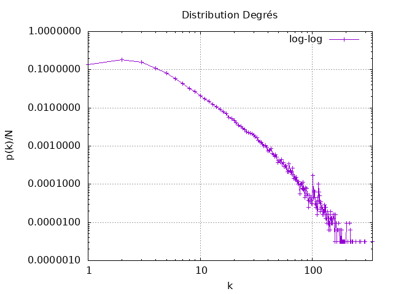
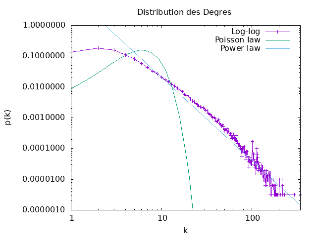

## Mesures de réseaux d'intéraction (réseau de collaboration scientifique en informatique)


## Question 2

Quelues Mesures de base :
```
|N| = 317080
|L| = 1049866
<k>  = 6.62208890914917
Densité = 2.0884666810161434E-5
C  = 0.6324308280637396
```
## Question 3

Le réseau scientifique est bel et bien connexe.
Car on a \<k\> >= ln(N)
Le seuil critique pour qu'un réseau aléatoire devienne connexe est atteint lorsque le nombre moyen de liaisons par nœud **\<k\>** est égal ou supérieur à **ln(N)**, où **N** représente le nombre total de nœuds dans le réseau.
**\<k\> >= ln(N)**

## Question 4



Le tracé en échelle log-log de la distribution des degrés montre une courbe plutôt qu'une ligne droite.


En traçant la distribution de degrés en échelle log-log on observe une ligne pseudo-droite similaire à celle de la distribution de puissance . Cela nous indique qu'elle suit une loi de puissance .

Coefficients :

lc ≈ 2.34241 | 
γ ≈ 2.70539

## Question 5

La distance moyenne, calculée à partir d'un échantillon de 1000 nœuds, est de 6.789172899583702. Pour déterminer si ce réseau peut être considéré comme un réseau petit monde, il est nécessaire de vérifier si sa distance moyenne est approximativement égale à **ln⁡(N) / ln⁡⟨k⟩**. En comparaison, la distance moyenne dans un réseau aléatoire présentant des caractéristiques similaires de taille et de degré moyen est d'environ ln(317080) / ln(6.62208890914917) ≈ 6.700611818856679. Étant donné que **ln(⁡N)/ln⁡⟨k⟩ est proche de ⟨d⟩**, ce réseau peut être qualifié de réseau **petit monde**.

L'hypothèse des six degrés de séparation se confirme partiellement, car bien que la distance moyenne entre les individus du réseau soit proche de 6, il existe des distances qui dépassent cette valeur. Cela suggère une certaine variabilité dans les connexions, avec une tendance générale à respecter l'idée des six degrés de séparation, mais des exceptions existent sous la forme de distances plus importantes que 6 entre certains noeuds.

Dans un réseau aléatoire avec les mêmes caractéristiques de degré moyen, nombre de nœuds et distance moyenne, la distance moyenne peut être approximée par la formule de la distance moyenne dans un réseau aléatoire. Cette formule est donnée par : **⟨d⟩ ≈ ln(N) / ln(⟨k⟩)**. qui est la même dans nnotre réseau , alors la distance moyenne d'un réseau aléatoire avec es mêmes caractéristiques sera similaire.


Après avoir tracé la distribution des distances dans un réseau, l'hypothèse est que la forme de cette distribution ressemble à une loi normale, qui suggère que la plupart des distances entre les nœuds du réseau se situent autour d'une moyenne d'environ 6.9. En d'autres termes, la majorité des relations entre les nœuds semblent suivre une tendance centrale avec une concentration significative autour de cette valeur moyenne. Ce résultat peut indiquer une certaine régularité ou normalité dans la manière dont les nœuds du réseau sont connectés, ce qui est souvent associé à des propriétés spécifiques, telles que celles observées dans les réseaux de type "petit monde".


Dans un réseau de type "Petit Monde", la plupart des nœuds sont connectés à leurs voisins les plus proches, mais il existe également quelques connexions à des nœuds distants, créant ainsi des raccourcis efficaces dans le réseau.

Hypothèse sur la loi de distribution des distances dans un réseau de type "Petit Monde" :

1. **Distribution des distances courte :** La plupart des nœuds dans le réseau sont connectés à leurs voisins les plus proches, ce qui crée une distribution de distances courte. Cela se traduit par un grand nombre de paires de nœuds avec des distances relativement faibles.

2. **Quelques distances longues :** En raison des connexions à des nœuds distants, il existe quelques paires de nœuds avec des distances relativement longues. Ces distances longues représentent les raccourcis dans le réseau qui caractérisent le concept de "Petit Monde".

3. **Distribution globalement asymétrique :** La distribution des distances peut être globalement asymétrique, avec une concentration de distances courtes du côté gauche de la distribution et quelques distances longues du côté droit.

4. **Présence de clusters locaux :** Les clusters locaux de nœuds fortement connectés entre eux peuvent être présents, contribuant à la création de distances courtes à l'intérieur de ces clusters.

5. **Indice de Clustering Élevé :** Un indice de clustering élevé, indiquant que les voisins d'un nœud sont également connectés entre eux, peut être observé. Cela contribue à la présence de clusters locaux.


## Question 6

### Comparaison : 

##### Distribution des Degrés


La distribution des degrés dans le réseau de collaboration sur le terrain présente une similitude marquée avec celle observée dans le modèle de Barabasi-Albert. Cette similitude suggère que, dans le contexte des collaborations sur le terrain, certaines entités ont tendance à développer des collaborations plus fréquentes avec d'autres entités déjà fortement impliquées. Ce phénomène est caractéristique de l'attachement préférentiel, un mécanisme fondamental dans le modèle de Barabasi-Albert, où les nouveaux nœuds ont une probabilité plus élevée de se connecter aux nœuds déjà très connectés.

En revanche, la distribution des degrés dans le graphe aléatoire, qui suit une loi de Poisson, diffère notablement. Dans un réseau aléatoire, chaque nœud a une probabilité égale de se connecter à d'autres nœuds, conduisant à une distribution de degrés relativement uniforme. L'absence d'attachement préférentiel dans le graphe aléatoire se traduit par une absence de hubs, en contraste avec les réseaux de collaboration et Barabasi-Albert.

Ainsi, la similitude entre la distribution des degrés du réseau de collaboration sur le terrain et celle du graphe Barabasi-Albert indique une influence significative de l'attachement préférentiel dans ces deux contextes. En comparaison, le graphe aléatoire, en suivant une loi de Poisson, souligne la nature plus uniforme des connexions, mettant en évidence les différences fondamentales dans les mécanismes de connexion entre ces modèles de réseaux.

##### Distribution des Distances


Lorsqu'on examine la distribution des distances dans le graphe de collaboration sur le réseau de collaboration scientifique (le terrain), on constate une similitude significative avec la distribution observée dans le graphe aléatoire. Cette similitude peut s'expliquer par le caractère aléatoire des connexions dans le réseau de collaboration de terrain. Dans un réseau aléatoire, où chaque nœud a une probabilité égale de se connecter à d'autres nœuds, la distribution des distances a tendance à être plus uniforme, ce qui pourrait expliquer le rapprochement observé.

En revanche, la distribution des distances dans un réseau Barabasi-Albert diffère substantiellement. Le modèle Barabasi-Albert, caractérisé par l'attachement préférentiel, favorise la formation de hubs, conduisant à des distances plus courtes entre les nœuds. La moyenne des distances dans un réseau Barabasi-Albert est ainsi plus petite, ce qui témoigne de la propension de ce modèle à créer des connexions courtes entre les nœuds centraux du réseau.

##### Quelques Mesures : 

| *Mesure*     | R Collaboration | random    | Barabasi-Albert
|--------------|-----------------|-----------|-------------
| $`\|N\|`$    | 317 082         | 317 082   | 317 082
| $`\|L\|`$    | 1 049 866       | 1 050 027 | 1 108 550
| $`< k >`$    | 6.622           | 6.6229    | 6.99
| $` C `$      | 0.632           | 1.631 E-5 | 3.94 E-4
| $`Densité `$ | 2.088  E-5      | 2.088 E-5 | 2.20 E-5
| $`< d >`$    | 6.9             | 6.70      | 7.06
| Connexité    | ✅               | ❌         | ✅


Les mesures de votre réseau collaboratif, du réseau aléatoire et du réseau Barabasi-Albert semblent avoir des caractéristiques distinctes. Voici quelques observations par rapport aux attentes théoriques :

1. **Nombre de nœuds ( |N| ) :**
    - Les trois réseaux ont le même nombre de nœuds (317 082), ce qui correspond aux attentes théoriques.

2. **Nombre de liens ( |L| ) :**
    - Les réseaux collaboratif et Barabasi-Albert ont des nombres de liens similaires, tandis que le réseau aléatoire a un nombre légèrement différent. Cela peut être dû à la nature aléatoire de la construction du réseau.

3. **Degré moyen (<k\>) :**
    - Les degrés moyens sont cohérents avec les attentes théoriques, avec des valeurs proches des valeurs cibles.

4. **Coefficient de Clustering ( C ) :**
    - Le réseau collaboratif a un coefficient de regroupement moyen significatif ( C  = 0.632 ), indiquant une certaine structure de regroupement. Le réseau aléatoire a un coefficient de regroupement négligeable, ce qui est attendu dans un réseau aléatoire. Le réseau Barabasi-Albert a également un faible coefficient de regroupement.

5. **Distance moyenne ( d ) :**
    - La distance moyenne est cohérente avec les attentes théoriques. Le réseau aléatoire a une distance moyenne légèrement inférieure à celle du réseau collaboratif, ce qui est typique des réseaux aléatoires. Le réseau Barabasi-Albert a une distance moyenne légèrement plus élevée.

6. **Connexité :**
    - Le réseau collaboratif et le réseau Barabasi-Albert sont connexes, tandis que le réseau aléatoire ne l'est pas. Cela correspond aux attentes théoriques.

Globalement, les mesures semblent cohérentes avec les attentes théoriques, avec quelques différences qui peuvent être attribuées aux propriétés spécifiques.


### Conclision
La comparaison avec un réseau aléatoire et un réseau Barabasi-Albert met en évidence des différences significatives. Le réseau collaboratif partage des similitudes avec le modèle Barabasi-Albert plus le réseau aléatoire. 
Ensuite l'analyse des mesures offre un aperçu approfondi de la structure du réseau de collaboration scientifique en informatique, mettant en évidence ses propriétés complexes, son caractère petit monde, et des similitudes avec le modèle de Barabasi-Albert, tout en soulignant des distinctions par rapport à un réseau aléatoire.


## Propagation

1. **Taux de Propagation du Virus :**
   - Les paramètres de la simulation sont définis avec β=`1/7` pour la probabilité de contaminer un collaborateur et `µ = 1/14` pour la probabilité de mettre à jour l'antivirus.
   - En conséquence, le taux de propagation est donné par `λ = β/µ = 2`.

2. **Seuil Épidémique du Réseau :**
   - Le seuil épidémique du réseau est déterminé par l'équation `λc = ⟨k⟩/⟨k²⟩`.
   - Avec `<k> = 6.622` et `<k²> = 144.631`$, le seuil épidémique est approximativement `λc ≈ 0.046`.

3. **Comparaison avec le Seuil Théorique d'un Réseau Aléatoire du Même Degré Moyen :**
   - Le seuil épidémique d'un réseau aléatoire avec le même degré moyen serait `λc = 1 / ( <k> + 1) ≈ 0.131`.
   - La différence entre ces seuils épidémiques est attribuable à la divergence du degré de clustering.


Simuler la propagation du virus jour par jour pendant trois mois avec les scénarios suivants :

On ne fait rien pour empêcher l'épidémie
On réussit à convaincre 50 % des individus de mettre à jour en permanence leur anti-virus (immunisation aléatoire)
On réussit à convaincre 50 % des individus de convaincre un de leurs contacts de mettre à jour en permanence son anti-virus (immunisation sélective).

Pour chacun des trois scénarios, on va tracer l'évolution de la fraction d'infectés de la population non immunisée.

### Graphe DBLP


##### Observation : 

- Dans des conditions de simulation normales, l'immunisation aléatoire présente un léger ralentissement de la propagation du virus. qui déscend jusqu'à environ 27,35% infectés .

- En revanche, malgré un nombre de nœuds immunisés inférieur ou égal à celui de l'immunisation aléatoire, l'immunisation sélective parvient à retarder et à entraver efficacement la propagation du virus (10,2% infectés).

#### Justification : 
Pour justifier l'efficacité de l'immunisation sélective, On calculer le degré moyen des groupes 0 et 1 :
- groupe0: `<k0> = 4,882636`
- groupe1: `<k1> = 5,365981` 

Dans le groupe 1, on observe davantage de hubs `<k0> < <k1>`, car ils ont une forte chance d'être immunisés par l'un de leurs voisins. Cela souligne l'impact notable de l'immunisation sélective dans ce groupe, favorisant ainsi une plus grande présence de nœuds centraux. Ces résultats mettent en évidence l'importance de l'immunisation des hubs pour aider à freiner la propagation du virus au sein du réseau.

#### 4. Du point de vue du virus l'immunisation d'un nœud est équivalente à sa suppression du réseau. 
On va alors  alculer le seuil épidémique du réseau modifié pour chacune des deux stratégies d'immunisation et comparer avec le seuil épidémique du réseau initial.

- λc (S1) = 0,045985
- λc (S2) = 0,045446
- λc 3 (S3) = 0,094457

Le seuil épidémique du Scénario 2 est essentiellement comparable à celui du Scénario 1, car la taille du réseau n'exerce pas d'influence significative sur son seuil épidémique.
En revanche, le réseau sélectif présente un seuil épidémique environ deux fois supérieur aux autres. Cette observation peut être expliquée par la suppression d'un grand nombre de hubs du réseau sélectif, limitant ainsi la propagation du virus.

### 5. 
#### Simuler l'épidémie avec les mêmes hypothèses et les mêmes scénarios dans un réseau aléatoire et un réseau généré avec la méthode d'attachement préférentiel de la même taille et le même degré moyen. Comparer et commenter les résultats.
### Graphe Aléatoire


##### Observation : 
Il est constaté que la propagation du virus dans le scénario 3 est plus significative que dans le scénario 2, bien que les deux restent moins importants que dans le premier scénario. De plus, il est remarquable que tous les scénarios présentent le même seuil épidémique.
- λc (S1) = 0,131091
- λc (S2) = 0,131086
- λc (S3) = 0,140205


- groupe0: `<k0> = 5,459824`
- groupe1: `<k1> = 4,783283`
- `<k1> < <k0> ` !

##### Justification : 
 -  l'efficacité réduite de l'immunisation sélective dans un réseau aléatoire découle de la difficulté à cibler efficacement les nœuds les plus influents , en raison de la nature aléatoire des connexions et de la faible variabilité des degrés de connexion entre les nœuds.


- Le fait que tous les scénarios aient le même seuil épidémique dans un réseau aléatoire indique que, quel que soit le niveau d'immunisation, la nature aléatoire des connexions a un impact limité sur la propagation du virus. Les connexions sont distribuées de manière uniforme, et l'immunisation n'a pas d'effet significatif sur la dynamique de l'épidémie dans ce type de réseau.


### Graphe Préférentiel


##### Observation :
On observe que le nombre d'individus infectés dans les scénarios 2 et 3 est similaire, bien que le seuil épidémique du scénario 3 soit plus élevé.


- λc (S1) = 0,029265
- λc (S2) = 0,023801
- λc (S3) = 0,139962


- groupe0: `<k0> = 5,112790`
- groupe1: `<k1> = 5,632330`

##### Justification :

Dans un réseau préférentiel intensément interconnecté et dynamique, l'immunisation sélective, ciblant les nœuds clés, parvient à retarder initialement la propagation virale en éliminant des points de transmission cruciaux. Cependant, la nature complexe du réseau permet au virus de s'adapter, atteignant finalement un pourcentage d'infectés similaire à celui de la propagation aléatoire.
